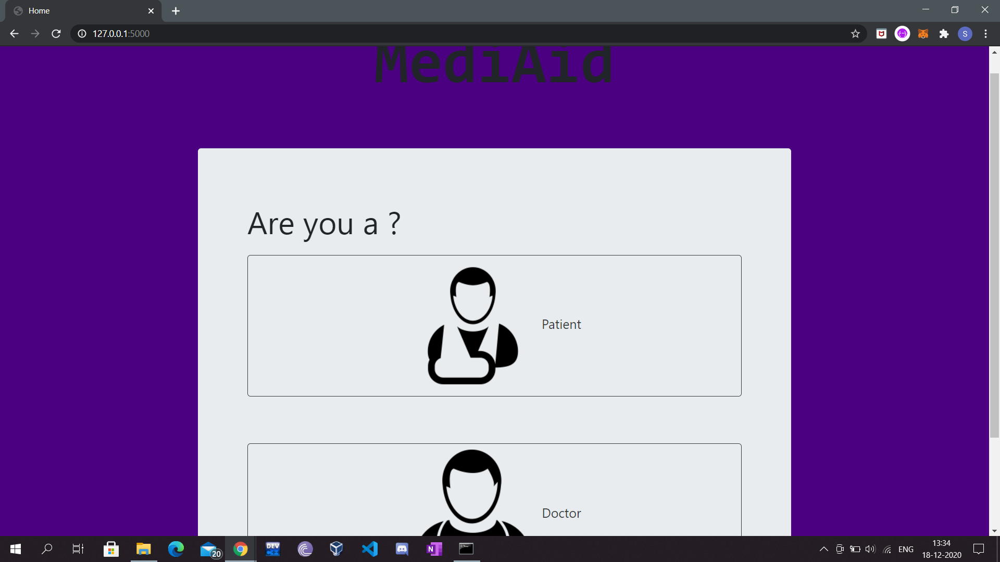
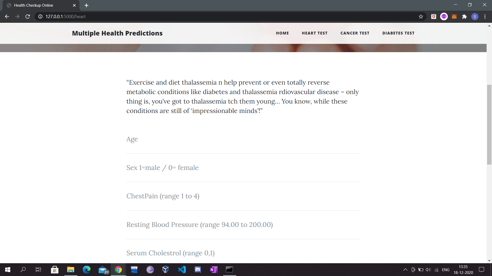
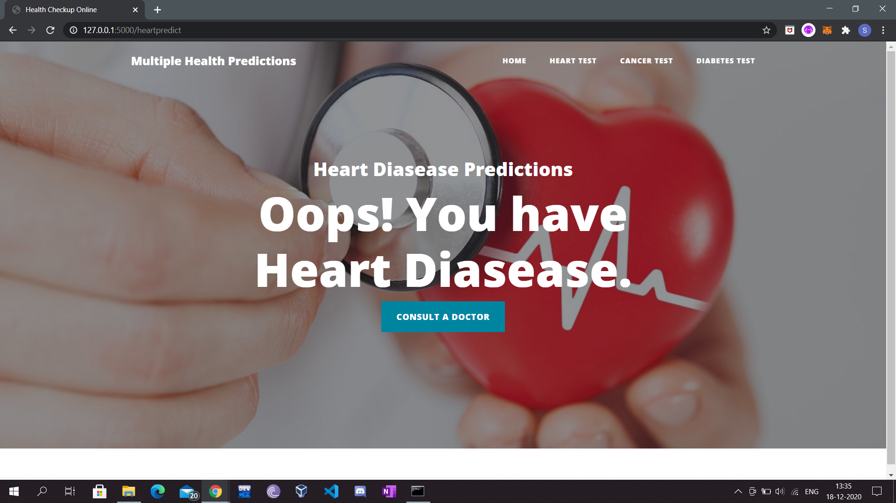
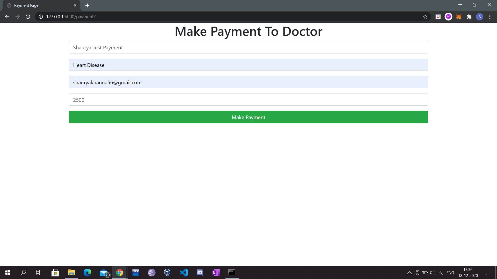
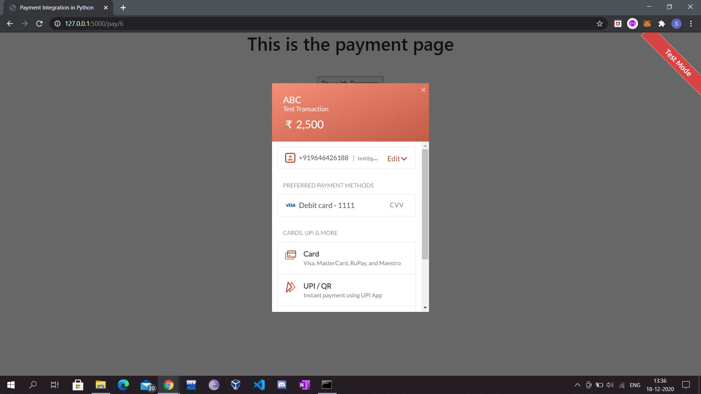
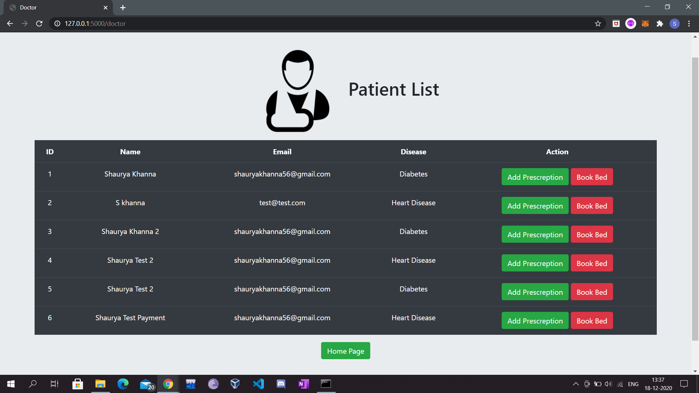
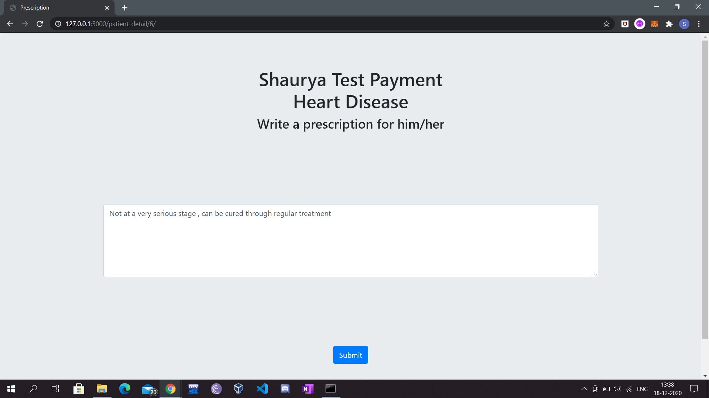
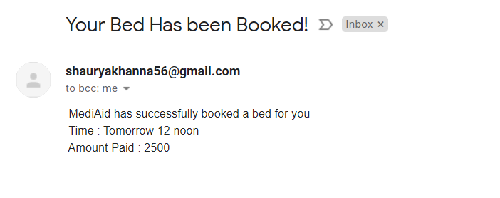

# Health Checkup Predictions

# MediAid is a web app made with Flask which uses ML to predict disease and sqlite database to store patient information. People can predict Heart Disease , Cancer , Diabetes through this web app. Doctors also receive this information and can contact the patient directly to book an appointment and all the details of the appointment will be sent to the patient via mail. Payments integration is done through razorpay 

